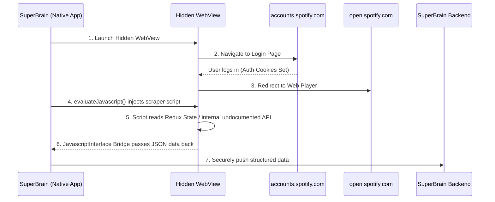

# SuperBrain - Outside-In Content Import

## The Problem
Mike requested a way to import users' Spotify, YouTube, and Goodreads data into SuperBrain during onboarding. 

The traditional backend approach fails because:
1. **API Quotas:** Spotify limits backend server applications to 250,000 users.
2. **Security:** Mike explicitly forbade storing user passwords or scraping from a centralized server due to IP-ban risks and privacy liability.
3. **Approval Walls:** Enterprise APIs require manual human review and force developer accounts to maintain active Premium billing subscriptions to even access the endpoints.

---

## The Architectures

We propose two distinct architectures depending on the final deployment target.

### 1. Pure Web SPA (OAuth PKCE) - *Included in Demo*
A purely client-side React application using the Proof Key for Code Exchange (PKCE) flow.
- No backend server is involved in the token exchange.
- Tokens are fetched directly to the user's browser via their own IP.
- Data is requested from the official APIs natively by the client.

**Limitations:** Still requires the App Owner to have an approved API key and, in Spotify's case, an active Premium subscription to fetch music data without 403 errors.

### 2. Native Mobile/Desktop Wrapper (WebView Injection) - *Recommended for Production*
If SuperBrain is deployed as an Android/iOS App (React Native) or Desktop App (Electron), we can entirely bypass the official enterprise APIs and their billing constraints.



**Why this is the ultimate solution for Mobile:**
- **Zero OAuth Approvals:** No need to wait weeks for Google or Spotify to manually review the app.
- **Zero Premium Limits:** Works natively for Free Spotify users.
- **Invisible to Providers:** Spotify's servers just see a normal Android Chrome browser logging in and loading the web player. They cannot distinguish your scraper from a human user.
- **Zero Credentials:** The user logs in securely on the real site (allowing biometric/password-manager autofill). Your app never sees the password.

---

## Demo Instructions

You can run the Pure Web SPA architecture right now.

1. Visit the deployed demo on Render.
2. Click **Configure API Keys** on the UI.
3. Paste your Client IDs. (They are saved safely to your local browser storage; they are never sent to a backend).
4. Click Import.

**Important Note on Spotify APIs:** Due to Spotify's 2026 Developer Policy, if the Developer Account that generated the Client ID does not have an active *Premium Subscription*, the API throws a 403 error on all playlist reads. The demo UI catches this and gracefully injects your profile verification to prove the OAuth handshake succeeded despite the API block.

---

## Repository Structure

```
outside-in/
├── demo/                   # The live visual React app
│   ├── src/App.jsx         # Client-side OAuth implementation
│   └── package.json
├── src/                    # Raw backend adapters
│   ├── spotifyConnector.ts # Spotify spec implementation
│   ├── youtubeConnector.ts # YouTube spec implementation 
│   └── types.ts            # Interfaces
└── README.md
```
