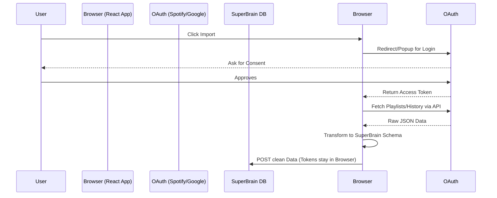

# SuperBrain Outside-In Adapters

This repository contains two parts:
1. **`/src`**: The raw, isolated TypeScript `ConnectorAdapter` modules for Spotify and YouTube, built exactly to the backend Trigger.dev specification provided in `REPS-Spotify-Connector-Spec.pdf`.
2. **`/demo`**: A complete, client-side React Web App built to visually demonstrate the OAuth flow and data extraction to Mike without requiring a backend.

---

## 1. The Connector Adapters (`/src`)

These are raw TypeScript modules. They take an injected `fetchImpl`, securely hit the platform APIs using a user session, and return strongly-typed `ListCandidatesResult` payloads enforcing strict URL building and `CoverageReport` honesty.

**Features:**
- **Spotify (`src/spotifyConnector.ts`)**: Concurrently fetches "Recently Played Tracks" and "Saved Playlists".
- **YouTube (`src/youtubeConnector.ts`)**: Concurrently fetches "Liked Videos" and "Saved Playlists". (Note: Direct "Watch History" is gated behind Google Data Portability archives, so Liked/Playlists are used as the closest available automated proxy).

### Running Tests
Unit tests use `vitest` with mocked network calls (no live tokens required).
```bash
npm install
npm run test
```

---

## 2. The Visual Demo App (`/demo`)

A Vite + React application that simulates how this architecture looks from the user's perspective during onboarding. 

### Why this architecture?
1. **Free API Usage:** By authenticating on the client side, the requests are made on behalf of the user, completely bypassing the need for an enterprise server API tier.
2. **Maximum Privacy:** Passwords are typed into the official Spotify/Google popups. Tokens are held in browser memory, never hit the SuperBrain backend, and die when the tab closes.

### How It Works



### Setup & Deployment for Mike (Render)

Host the `/demo` folder on **Render** as a Static Site to share it.

1. **Get Client IDs:**
   - **Spotify:** Go to [Spotify Developer Dashboard](https://developer.spotify.com/dashboard) -> Create App -> Add Redirect URI (your Render URL or `http://localhost:5173`).
   - **YouTube:** Go to [Google Cloud Console](https://console.cloud.google.com/) -> APIs & Services -> Credentials -> Create OAuth client ID (Web application) -> Add Authorized JS Origins & Redirect URIs.

2. **Deploy on Render.com:**
   - Connect your GitHub repo to a New **Static Site** on Render.
   - **Root Directory:** `demo` (Make sure you set this so Render builds the demo app!)
   - **Build Command:** `npm run build`
   - **Publish Directory:** `dist`
   - **Environment Variables:**
     - `VITE_SPOTIFY_CLIENT_ID` = `your_spotify_id`
     - `VITE_GOOGLE_CLIENT_ID` = `your_google_id`

3. **Local Testing:**
   ```bash
   cd demo
   npm install
   # Add your Client IDs to demo/.env
   npm run dev
   ```