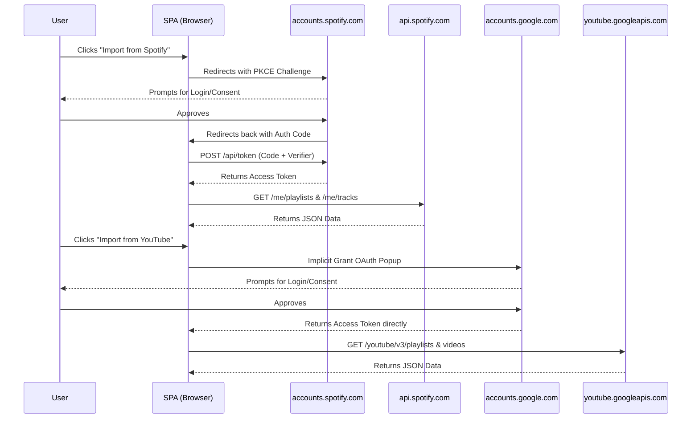
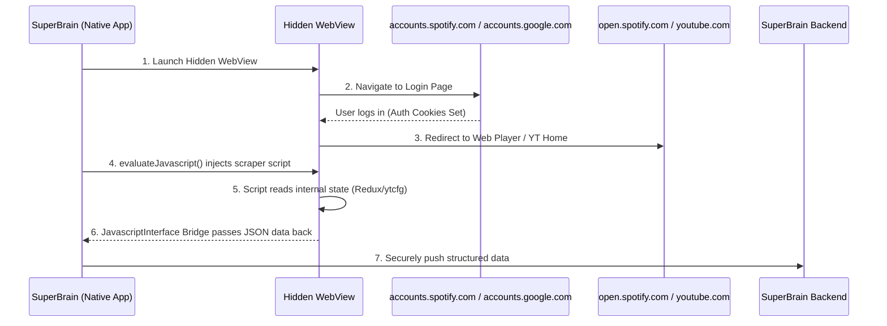

# SuperBrain - Outside-In Content Import

## The Problem
Stakeholders requested a secure, scalable way to import users' Spotify, YouTube, and Goodreads data into the platform during onboarding. 

The traditional backend approach fails because:
1. **API Quotas:** Spotify limits backend server applications to 250,000 users.
2. **Security:** Storing user passwords or scraping from a centralized server introduces severe IP-ban risks and privacy liability.
3. **Approval Walls:** Enterprise APIs require manual human review and force developer accounts to maintain active Premium billing subscriptions to access endpoints.

---

## The Architectures

We propose two distinct architectures depending on the final deployment target.

### 1. Pure Web SPA (OAuth PKCE & Implicit) - *Included in Demo*
A purely client-side React application. Uses Proof Key for Code Exchange (PKCE) for Spotify, and Implicit Grant (Data Portability) for YouTube.
- No backend server is involved in the token exchange.
- Tokens are fetched directly to the user's browser via their own IP.
- Data is requested from the official APIs natively by the client.



**Limitations:** Requires the App Owner to have an approved API key. Due to [Spotify's 2026 API changes](https://developer.spotify.com/documentation/web-api/tutorials/february-2026-migration-guide#premium-requirement), the developer account must have an active Premium subscription to fetch music data, otherwise it returns a 403 Forbidden error.

### 2. Native Mobile/Desktop Wrapper (WebView Injection) - *Recommended for Production*
If SuperBrain is deployed as an Android/iOS App (React Native) or Desktop App (Electron), we can entirely bypass the official enterprise APIs and their billing constraints.



**Why this is the ultimate solution for Mobile:**
- **Zero OAuth Approvals:** No need to wait weeks for Google or Spotify to manually review the app.
- **Zero Premium Limits:** Works natively for Free Spotify users.
- **Invisible to Providers:** Spotify's servers just see a normal Android Chrome browser logging in and loading the web player. They cannot distinguish your scraper from a human user.
- **Zero Credentials:** The user logs in securely on the real site (allowing biometric/password-manager autofill). Your app never sees the password.

---

## Demo Instructions

You can run the Pure Web SPA architecture right now.

1. Visit the deployed demo on Render.
2. Click **Configure API Keys** on the UI.
3. Paste your Client IDs. (They are saved safely to your local browser storage; they are never sent to a backend).
4. Click Import.

**Important Note on Spotify APIs:** Due to [Spotify's 2026 Developer Policy](https://developer.spotify.com/documentation/web-api/tutorials/february-2026-migration-guide#premium-requirement), if the Developer Account that generated the Client ID does not have an active *Premium Subscription*, the API throws a 403 error on all playlist reads. The demo UI catches this and gracefully displays an exact warning with the official documentation link.

---

## Repository Structure

```
outside-in/
├── demo/                   # The live visual React app
│   ├── src/App.jsx         # Client-side OAuth implementation
│   └── package.json
├── src/                    # Raw backend adapters
│   ├── spotifyConnector.ts # Spotify spec implementation
│   ├── youtubeConnector.ts # YouTube spec implementation 
│   └── types.ts            # Interfaces
└── README.md
```
